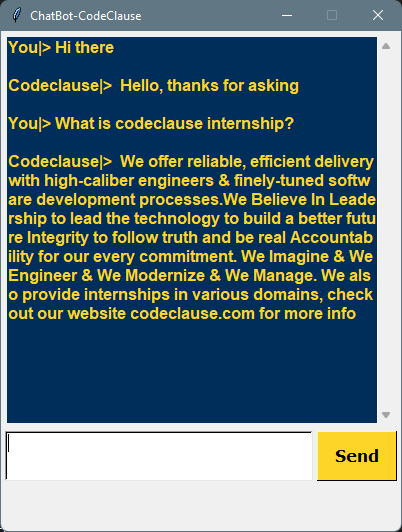
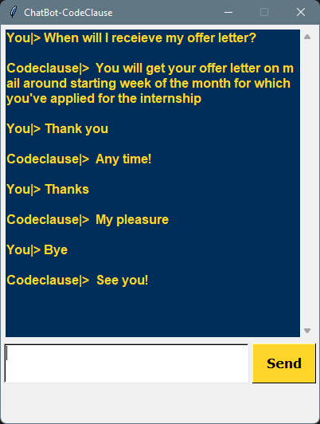

# ***Name: Ahmed Nasser Ahmed Hassan***
> **CodeClause |> *Sep/2022***
>> **Data Science Intern |> *CC-OL-911***
>>> **Task3 >> *ChatBot for CodeClause***

- <a href="https://www.linkedin.com/posts/ahmednasser1601_chatbot-data-science-codeclause-activity-6981536216462581760-NIzJ?utm_source=share&utm_medium=member_desktop">LinkedIn Post</a>
- <a href="https://youtu.be/4GylQMG-bto">YouTube Video</a>

---

  - ### <a title="AhmedNasser1601/ChatBot-CodeClause" href="ChatBot_CodeClause.ipynb"> ChatBot for CodeClause</a>
  
  > Based on |> <a href="intents.json">Intents File</a>
  
---

     
