# ***Name: Abhay Kumar***
> **CodeClause |> *July/2023***
>> **Data Science Intern **
>>> **Task1 >> *Stock Analysis***
  
  > Based on |> <a href="https://www.kaggle.com/datasets/pritsheta/netflix-stock-data-from-2002-to-2021">Netflix Stock data from 2002 to 2021</a>
  >> 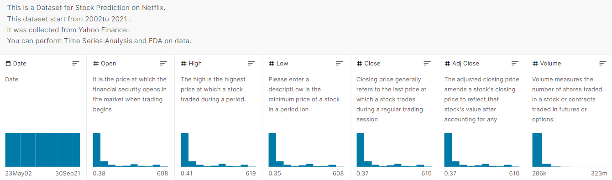
  
---

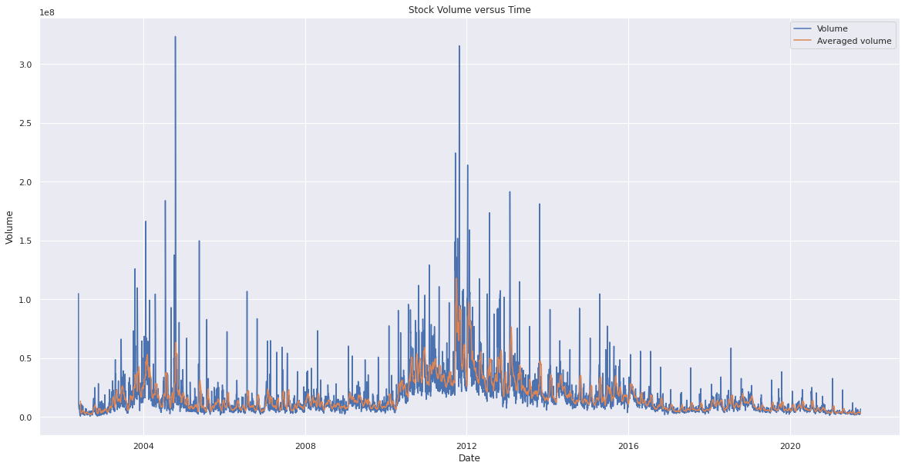  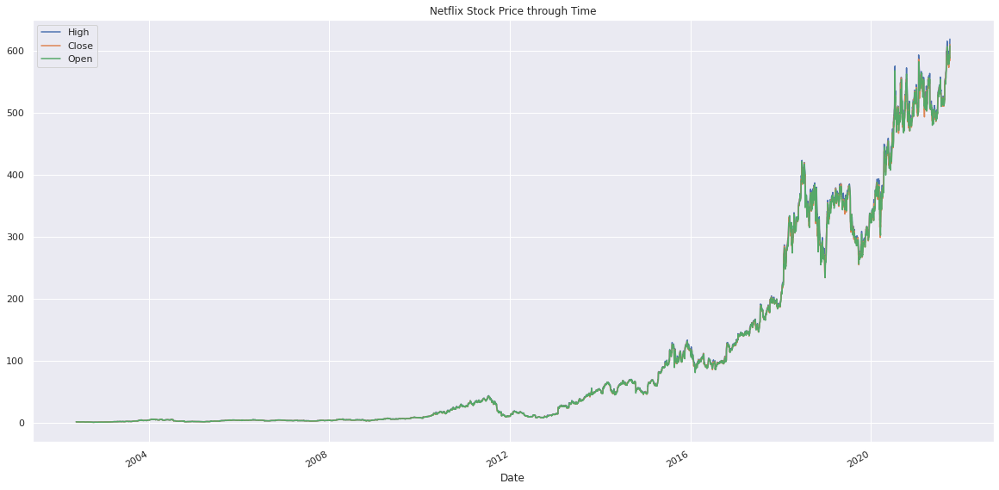  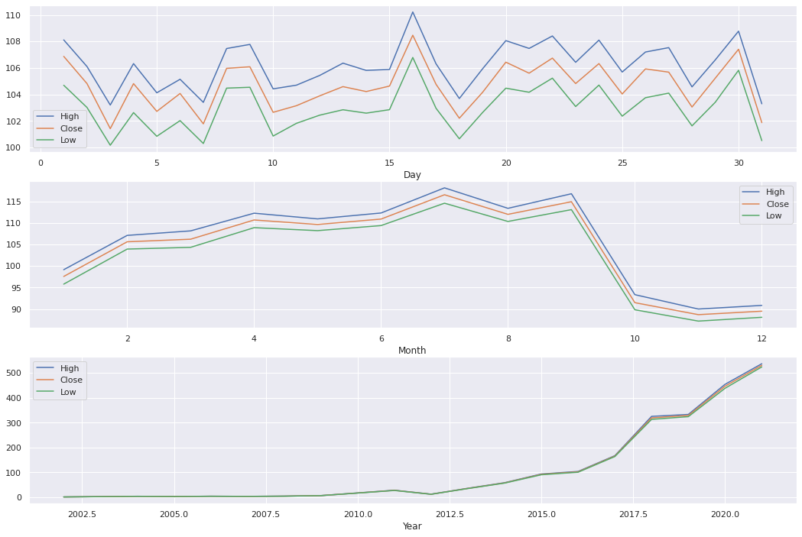    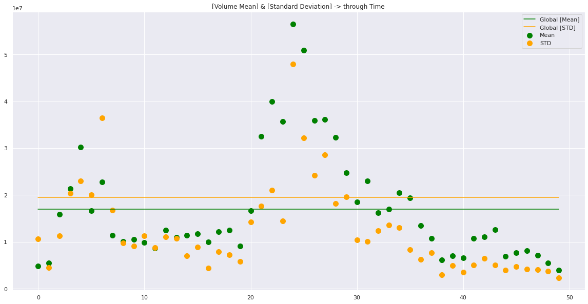  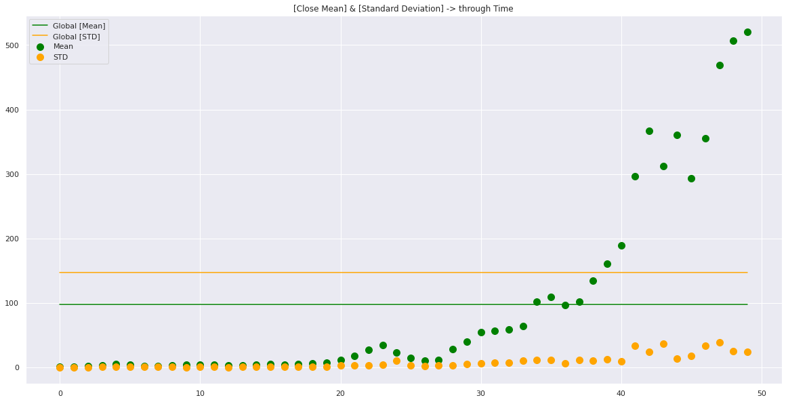  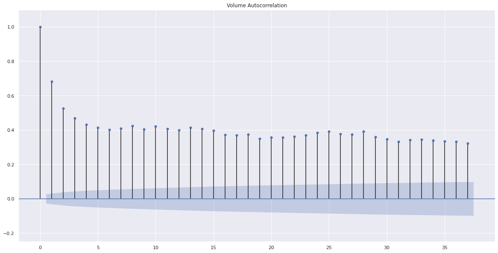  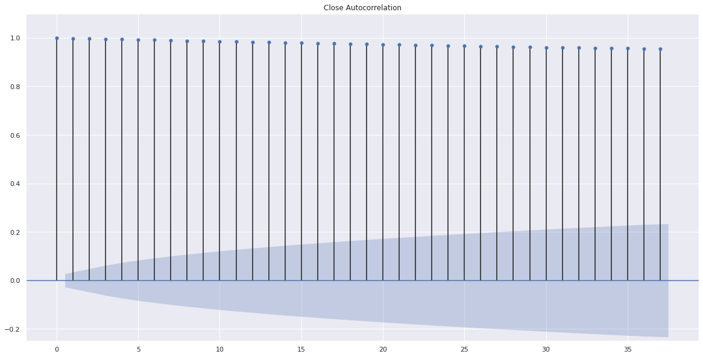  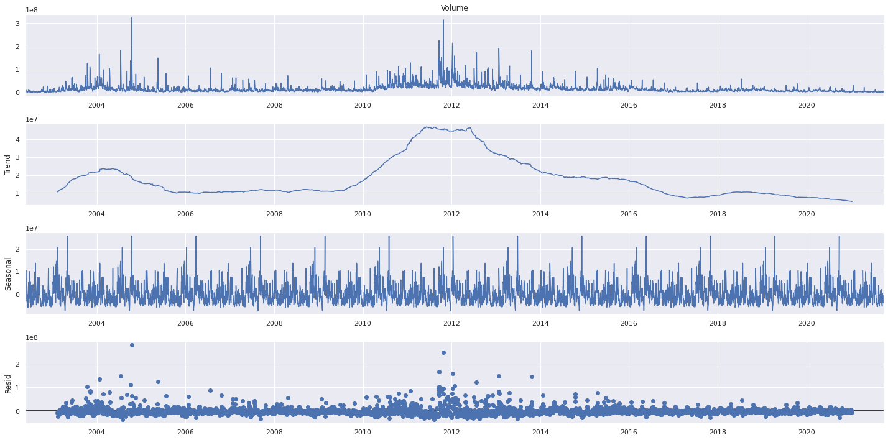  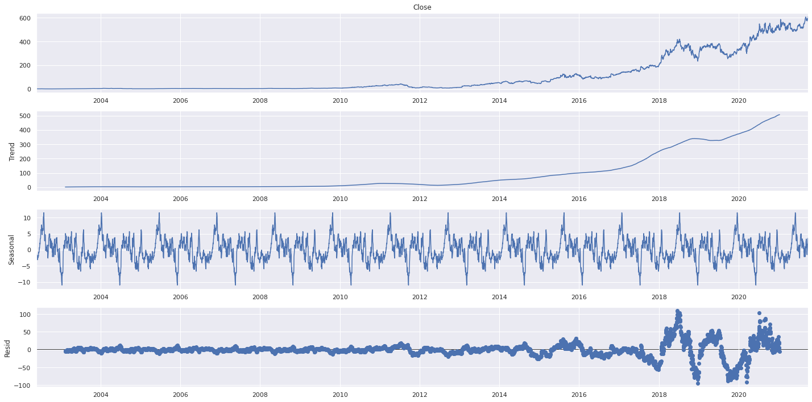  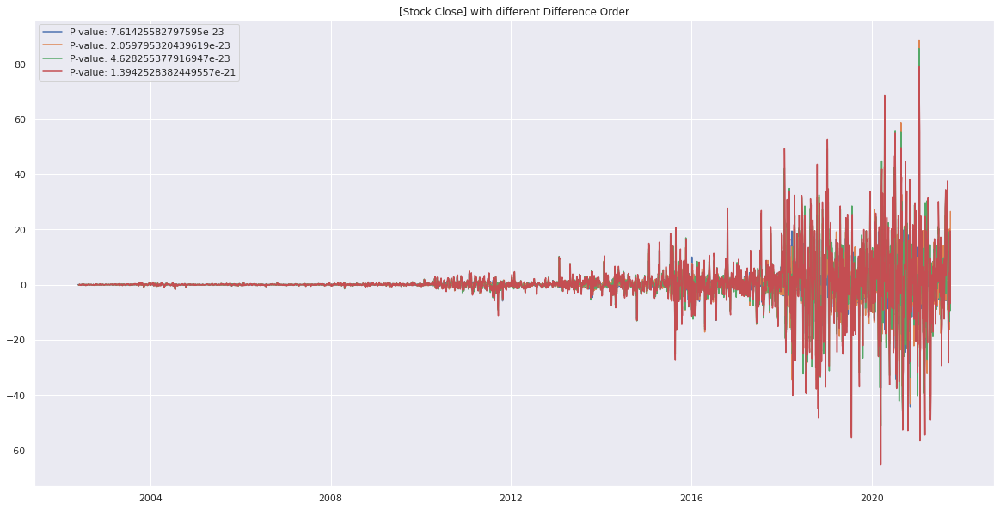  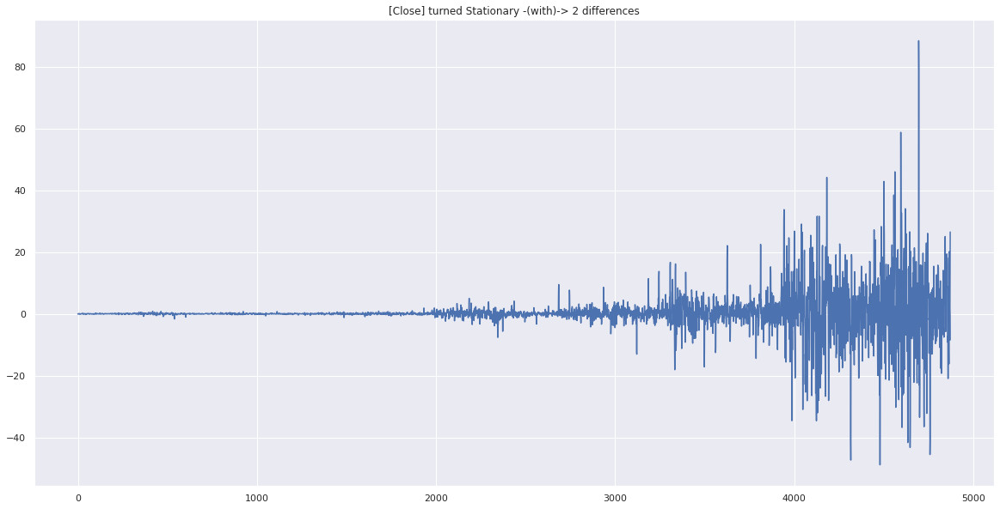  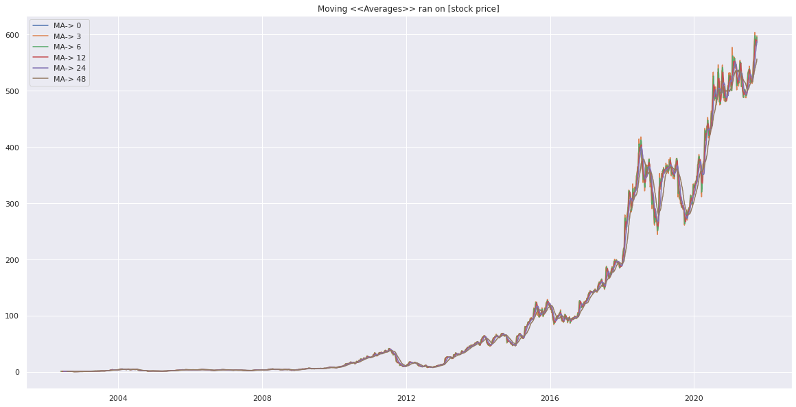  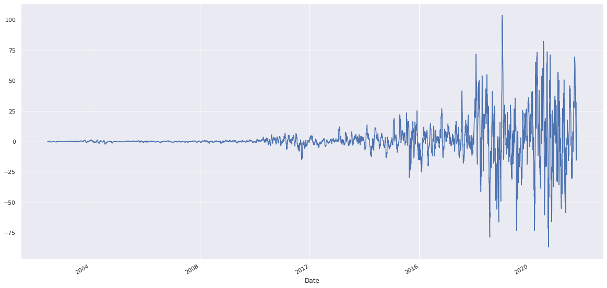  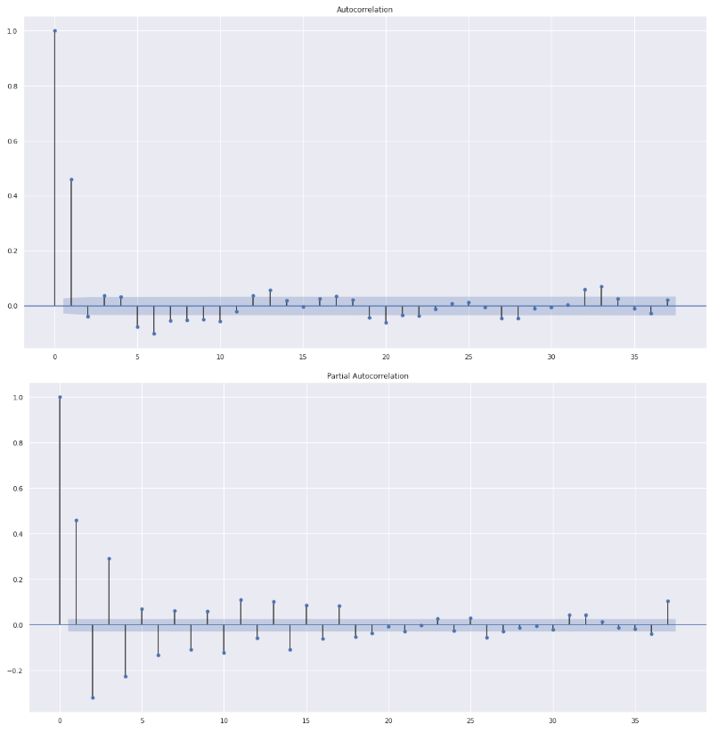  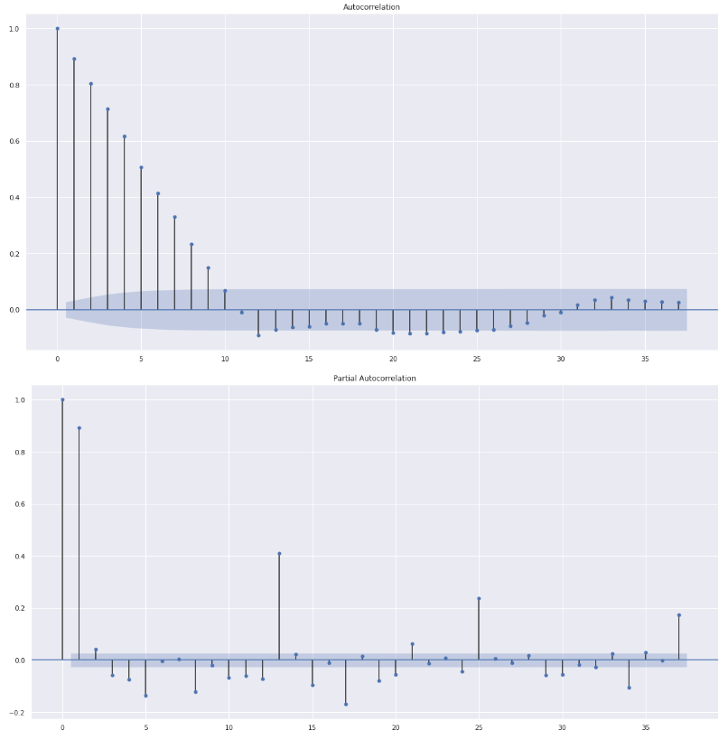  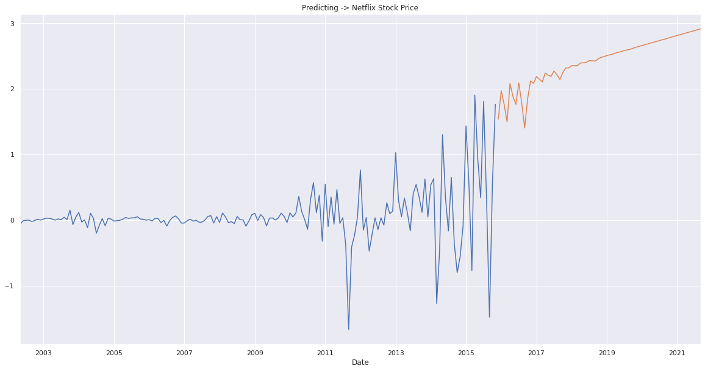  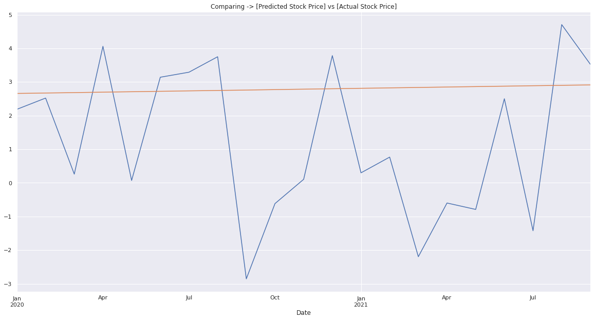  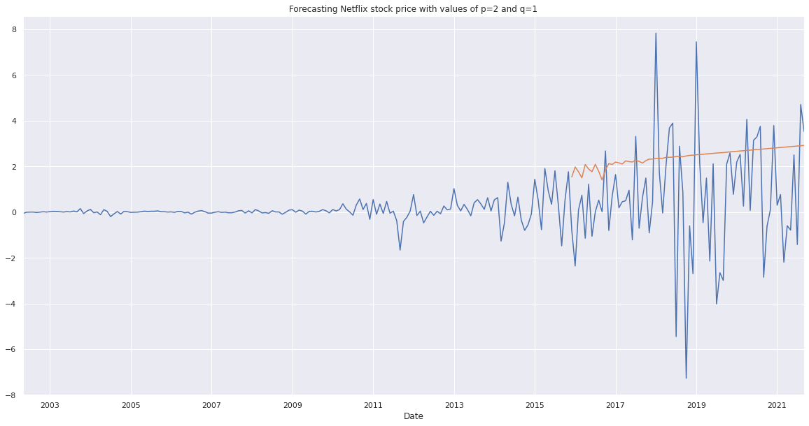

---
